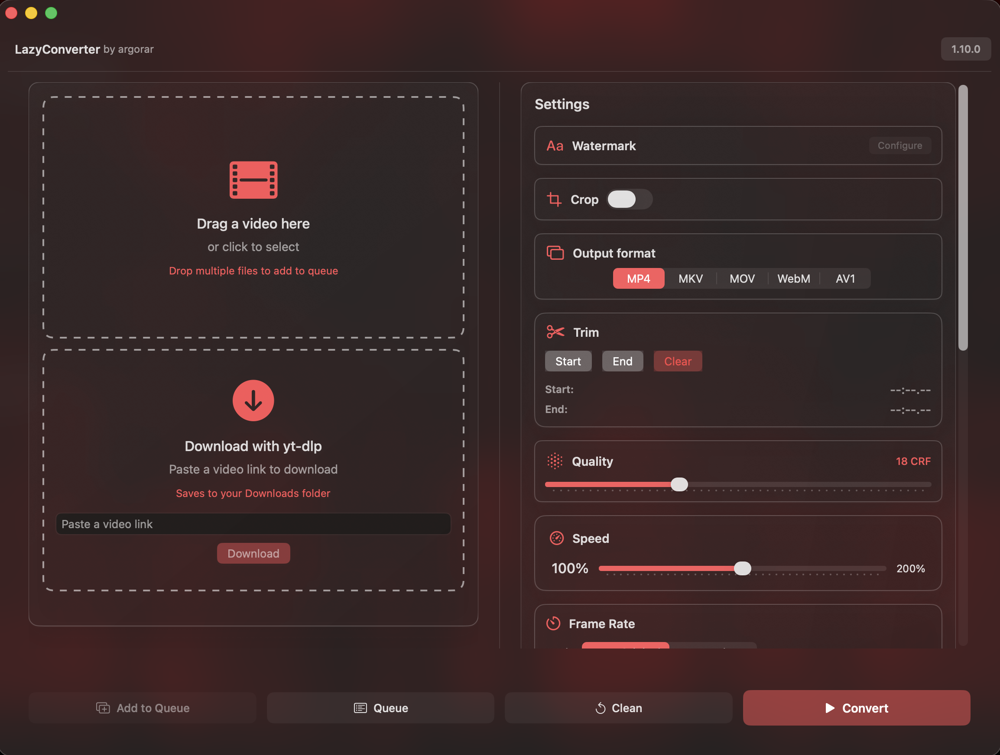

# LazyConverter

LazyConverter is a **native macOS app** for fast, simple, and privacy‑friendly video conversion and basic editing. Everything runs locally on your Mac using FFmpeg.

## ✨ Features

### 🎥 Video Conversion
- Convert videos to **MP4**, **MKV** and other common formats
- Choose output **resolution**: original, 4K, 1080p, 720p, etc.
- Control output **quality** with a percentage slider (1–100%)

### ⏱️ Speed Control & Trimming
- Adjust video **speed** (0.5x → 2x) with intuitive slider
- **Live preview** shows result in real-time
- Set **Trim Start/End** using current playback time
- Displays trim **duration** and progress HUD

### ✂️ Cropping
- Visual **crop overlay** on video preview
- Drag handles to define export region
- Normalized crop coordinates (adapts to any resolution)

### 🔍 Auto-Analysis
Automatically shows:
- Resolution (width × height)
- Duration
- File size
- **Frame rate (FPS)**

### ▶️ Smart Preview
- Native **AVPlayer** integration
- Live time readout: `current / total (XX%)`
- Crop overlay when enabled

## 🚀 Quick Start

1. **Drag & drop** a video file or click to select
2. **Adjust settings**:
   - Format (MP4/MKV)
   - Resolution & quality
   - Speed, trim, crop (optional)
3. **Click Convert** → outputs to temp folder
4. **Success banner** appears when done

**Made with ❤️ for macOS users**  
**LazyConverter · Convert videos without effort**

